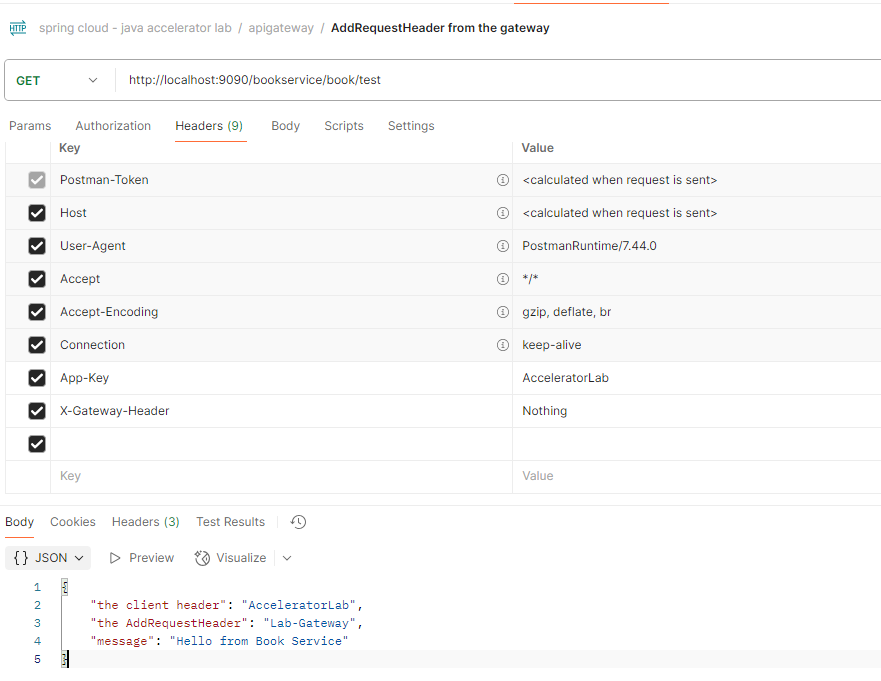

### Predicate: Route Based on Header
```yml
predicates[1]: Header=App-Key,AcceleratorLab
```
- Note
  - This ensures the route is matched only when the header `App-Key` has the value `AcceleratorLab`. - Nice one!!!

### Filter: Add a Custom Header to Outgoing Requests
```java
@Component public class CFilter implements GlobalFilter, Ordered {
  @Override public Mono<Void> filter(ServerWebExchange exchange, GatewayFilterChain chain) {
    var modifiedRequest = exchange.getRequest()
            .mutate()
            .header("X-Gateway-Header", "Lab-Gateway")
            .build();
    return chain.filter(
            exchange.mutate()
                    .request(modifiedRequest)
                    .build()
    );
  }
  @Override public int getOrder() {
    return -1;
  }
}
```
- This will add `X-Gateway-Header` : `Lab-Gateway` to the request sent to bookservice

## Test it
- Make a request like this using curl or Postman



### Circuit Breaker Pattern with API Gateway
- In microservices, if a downstream service (like bookservice) becomes slow or unavailable, we don’t want to keep sending requests to it — that would:
  - Overload the broken service even more 
  - Cause a bad user experience (long waits, errors)
- Note
  - It sort of Circuit acts like a fuse in your API Gateway  😂

```text

+------------+       +---------------+       +----------------+
|   Client   | --->  | API Gateway   | --->  | Book Service   |
+------------+       +---------------+       +----------------+
                           |
                           V
                  [Circuit Breaker Logic]
                           |
                   +------------------+
                   |     Fallback     |
                   |  (e.g., a msg)   |
                   +------------------+

```

- add the dependency
```xml
<dependency>
  <groupId>org.springframework.cloud</groupId>
  <artifactId>spring-cloud-starter-circuitbreaker-reactor-resilience4j</artifactId>
</dependency>
```

```text
        predicates[1]: Header=App-Key,AcceleratorLab
        filters:
          - name: CircuitBreaker
            args:
              name: myCircuitBreaker
              fallbackUri: forward:/inCaseOfFailureUseThis/booktest

```

- take a look at the fallback controller

```java

    @GetMapping("/fallback/book")
    public String bookTest(){
        return "📘 Book Service is currently unavailable. " +
                "Please try again later okay.. dont worry !!.";

    }
```

- to simulate, we stop the book service
  - or I just put a sleep there


## retries requests after a configured timeout.

```text

         +------------------+
Client → | Spring Gateway   |
         |   +------------+ |---> [Try BookService]
         |   | Circuit    | |
         |   | Breaker    | |
         |   +------------+ |
         |     +--------+   |
         |     | Retry  |   |
         |     +--------+   |
         |       ↓ fallback |
         |   /fallback/book |
         +------------------+

```
- what is going on here?

| Setting          | Meaning                                                         |
| ---------------- | --------------------------------------------------------------- |
| `retries: 3`     | Retry 3 times before giving up                                  |
| `statuses:`      | Retry only if gateway gets these status codes                   |
| `backoff:`       | Wait 2s, then 4s, then 5s between retries (exponential backoff) |
| `CircuitBreaker` | Kicks in if all retries fail                                    |


- modify the fallback


